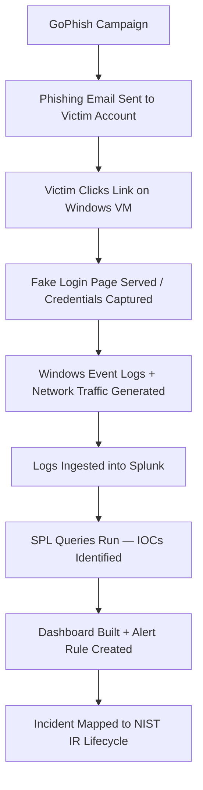

# Splunk
Project Idea: Phishing Email -> Detection with Splunk

<ins>Table of Contents:</ins>

*  Project Overview

*  Project Relevance

*  Methodology

*  Results

*  Conclusion

*  References

1. Project Overview:

This project will explore the use of GoPhish and Splunk within the context of Incident Response. My project will take a practical, simulation-based approach by staging a phishing attack in a controlled virtual environment and demonstrating how security teams detect, investigate, and respond to such an attack using a Security Information and Event Management (SIEM) platform. The goal is to show how GoPhish and Splunk work together in an incident response context by simulatuing a phishing campaign capturing the resulting logs, and building detection dashboards and alert rules that mirror real SOC workflows.

2. Project Relevance:

Why Phishing?

Phishing is regularly ranked as the leading initial attack vector in cybersecurity incidents. According to the Verizon Data Breach Investigations Report (DBIR) a significant majority of breaches involve a human element. Most commonly a user clicking a malicious link or submitting credentials to a fake login page. So knowing and understanding how phisihing attacks work is important to building effective incident response skills.

Why GoPhish?

GoPhish is an open-source phishing framework used by security teams to conduct authorized phishing simulations. It allows experts to:

*  Design realistic phishing emails and fake login pages

*  Send campaigns to target accounts in a controlled environment

*  Track engagement metrics in real time

In incident response (IR) understanding attacker techniques is just as important a sknowing how to defend against them. GoPhish provides hands-on exposure to phishing mechanics without requiring advanced offensive security skills. 

Why Splunk?

Splunk is one of the most widely used SIEM platforms in enterprise security environments. SOC analysts use Splunk to:

*  Ingest and centralize logs from multiple sources (endpoints, network devices, applications)

*  Search and correlate events to identify indicators of compromise (IOCs)

*  Build dashboards for real-time visibility into the environment

*  Create automated alert rules that trigger on suspicious activity

Skills Gained

Working through this project provides hands-on expereince with:

*  Phishing attack mechanics and social engineering techniques

*  Log analysis and threat hunting using Splunk Search Processing Language (SPL)

*  Mapping real-world attacks to the NIST SP 800-61 Incident Response Lifecycle

*  Building detection dashboards and writing alert rules

*  Communicating technical findings to both technical and non-technical audiences

3. Methodology

Environment Setup

| Component | Tool/Platform |
|-----------|---------------|
| Virtualization | VirtualBox |
| Victim Machine | Windows 10 VM |
| Phishing Framework | GoPhish |
| SIEM Platform | Splunk Free |
| Test Email Account | Dedicated Gmail account (victim) |

The lab runs within VirtualBox with the Windows VM acting as the simulated victim machine. GoPhish runs on the host machine and Splunk is installed on the Windows VM to inggest local logs.

Tools, Frameworks & Datasets

Tools:

*  GoPhish — Phishing simulation framework

*  Splunk Free — SIEM and log analysis platform

*  VirtualBox — Virtualization for isolated lab environment

Frameworks:

*  NIST SP 800-61 Rev. 2 — Incident Response Lifecycle

*  MITRE ATT&CK T1566 — Phishing technique classification

Datasets (Primary — Self-Generated):

*  GoPhish campaign logs (email opens, link clicks, credential submissions)

*  Windows Event Logs from victim VM

*  Network traffic logs from victim machine HTTP/HTTPS activity

*  Splunk query output and dashboard data

Workflow / Data Pipeline

Step-by-Step Process

Phase 1 — Preparation (Week 1)

1. Install VirtualBox and provision a Windows 10 VM

2. Install and configure GoPhish on the host machine
   
3.  Install Splunk Free on the Windows VM and configure log inputs
   
4. Create a test Gmail account to serve as the phishing victim

Phase 2 — Attack Simulation (Week 2)

1. In GoPhish, design a fake Microsoft 365 login page

2. Craft a phishing email ("Your password is expiring — update it now")
   
3. Launch the campaign targeting the test Gmail account
   
4. Open the email and click the link from within the Windows VM
   
5. Submit fake credentials on the fake login page
   
6. Document all GoPhish dashboard outputs (screenshots)

Phase 3 — Detection & Analysis (Week 3)

1. Confirm Windows Event Logs and network logs are flowing into Splunk
   
2. Run SPL queries to identify IOCs:

*  Suspicious outbound HTTP connections

*  DNS queries to unknown domains

*  Login events correlated with link-click timestamps

Build a Splunk dashboard visualizing the full incident timeline
Create an alert rule that fires on similar future activity
Map findings to the four NIST IR phases

Phase 4 — Reporting & Presentation (Week 4)

Finalize the written report
Record or rehearse the live demo
Build and rehearse the oral presentation

4. Results
  

