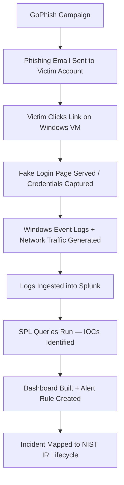

# GoPhish + Splunk
Project Idea: Phishing Email -> Detection with Splunk

**<ins>Table of Contents:</ins>**

*  Project Overview

*  Project Relevance

*  Methodology

*  Results

*  Conclusion

*  References

1. **<ins>Project Overview:</ins>**

This project will explore the use of GoPhish and Splunk within the context of Incident Response. My project will take a practical, simulation-based approach by staging a phishing attack in a controlled virtual environment and demonstrating how security teams detect, investigate, and respond to such an attack using a Security Information and Event Management (SIEM) platform. The goal is to show how GoPhish and Splunk work together in an incident response context by simulatuing a phishing campaign capturing the resulting logs, and building detection dashboards and alert rules that mirror real SOC workflows.

2. **<ins>Project Relevance:</ins>**

**Why Phishing?**

Phishing is regularly ranked as the leading initial attack vector in cybersecurity incidents. According to the Verizon Data Breach Investigations Report (DBIR) a significant majority of breaches involve a human element. Most commonly a user clicking a malicious link or submitting credentials to a fake login page. So knowing and understanding how phisihing attacks work is important to building effective incident response skills.

**Why GoPhish?**

GoPhish is an open-source phishing framework used by security teams to conduct authorized phishing simulations. It allows experts to:

*  Design realistic phishing emails and fake login pages

*  Send campaigns to target accounts in a controlled environment

*  Track engagement metrics in real time

In incident response (IR) understanding attacker techniques is just as important a sknowing how to defend against them. GoPhish provides hands-on exposure to phishing mechanics without requiring advanced offensive security skills. 

**Why Splunk?**

Splunk is one of the most widely used SIEM platforms in enterprise security environments. SOC analysts use Splunk to:

*  Ingest and centralize logs from multiple sources (endpoints, network devices, applications)

*  Search and correlate events to identify indicators of compromise (IOCs)

*  Build dashboards for real-time visibility into the environment

*  Create automated alert rules that trigger on suspicious activity

**Skills Gained**

Working through this project provides hands-on expereince with:

*  Phishing attack mechanics and social engineering techniques

*  Log analysis and threat hunting using Splunk Search Processing Language (SPL)

*  Mapping real-world attacks to the NIST SP 800-61 Incident Response Lifecycle

*  Building detection dashboards and writing alert rules

*  Communicating technical findings to both technical and non-technical audiences

3. **<ins>Methodology:</ins>**

**Environment Setup**

| Component | Tool/Platform |
|-----------|---------------|
| Virtualization | Oracle VirtualBox |
| Victim Machine | Windows 10 VM |
| Phishing Framework | GoPhish |
| SIEM Platform | Splunk Free |
| Test Email Account | Dedicated Gmail account (victim) |

The lab runs within Oracle VirtualBox with the Windows 10 VM acting as the simulated victim machine. GoPhish and Splunk Free runs on the host machine and Splunk Universal Forwarder is installed on the Windows 10 VM to help Splunk Free ingest local logs.

**Tools, Frameworks & Datasets**

**Tools:**

*  GoPhish — Phishing simulation framework

*  Splunk Free/Splunk Universal Forwarder — SIEM and log analysis platform

*  Oracle VirtualBox — Virtualization for isolated lab environment

**Frameworks:**

*  NIST SP 800-61 Rev. 2 — Incident Response Lifecycle

*  MITRE ATT&CK T1566 — Phishing technique classification

**Datasets (Primary — Self-Generated):**

*  GoPhish campaign logs (email opens, link clicks, credential submissions)

*  Windows Event Logs from victim VM

*  Network traffic logs from victim machine HTTP/HTTPS activity

*  Splunk query output and dashboard data

**Workflow / Data Pipeline**

**Step-by-Step Process**

**Phase 1 — Preparation (Week 1)**

1. Install Oracle VirtualBox and add a Windows 10 VM 

2. Install and configure GoPhish and Splunk Free on the host machine and configure log inputs
   
3. Install Splunk Universal Forwarder on the Windows 10 VM 
   
4. Create a test Gmail account on the Windows 10 VM to serve as the phishing victim

**Phase 2 — Attack Simulation (Week 2)**

1. In GoPhish, design a fake Microsoft 365 login page

2. Craft a phishing email ("Your password is expiring — update it now")
   
3. Launch the campaign targeting the test Gmail account
   
4. Open the email and click the link from within the Windows VM
   
5. Submit fake credentials on the fake login page
   
6. Document all GoPhish dashboard outputs (screenshots)

**Phase 3 — Detection & Analysis (Week 3)**

1. Confirm Windows Event Logs and network logs are flowing into Splunk
   
2. Run SPL queries to identify IOCs:

    * Suspicious outbound HTTP connections

    *  DNS queries to unknown domains

    *  Login events correlated with link-click timestamps

3. Build a Splunk dashboard visualizing the full incident timeline

4. Create an alert rule that fires on similar future activity

5. Map findings to the four NIST IR phases

**Phase 4 — Reporting & Presentation (Week 4)**

1. Finalize the written report
   
2. Record or rehearse the live demo
   
3. Build and rehearse the oral presentation

4. **<ins>Results:</ins>**
   

  

5. **<ins>Conclusion</ins>**

This project demonstrated how a phishing attack unfolds in practice and how security teams use SIEM tools to detect and respond to it. By simulating a complete phishing campaign using GoPhish and analyzing the resulting logs in Splunk, the project illustrated the full incident response lifecycle from the moment a malicious email is delivered to the moment an alert fires and evidence is collected.

Several key insights emerged from this work. First, phishing attacks are deceptively simple to execute. Using freely available open-source tools, a convincing phishing campaign can be stood up in a matter of hours, requiring minimal technical skill from the attacker. This underscores why phishing remains the most common entry point for data breaches across industries. Second, log visibility is everything in incident response. Without the Splunk Universal Forwarder collecting Windows Event Logs from the victim machine, the attack would have been completely invisible. The project reinforced that organizations without centralized log collection are essentially operating blind during an incident. Third, the correlation of multiple event types tells the full story. No single log entry revealed the attack on its own — it was the combination of logon events, new process creation, and network connection logs across the NIST IR timeline that painted a complete picture of what happened, when, and how.
Building and running the lab environment also produced valuable practical lessons. Configuring the Splunk Universal Forwarder to communicate with the Splunk indexer across a VirtualBox Host-Only network required troubleshooting firewall rules, network adapter settings, and configuration files — challenges that mirror the kinds of real-world setup and integration issues that SOC engineers face regularly. These hands-on difficulties provided a deeper understanding of how enterprise security infrastructure is built and maintained than any textbook could offer.

In terms of recommended improvements, several defensive measures would have prevented or significantly limited the impact of this attack in a real environment. Enforcing Multi-Factor Authentication (MFA) would have rendered the harvested credentials useless even after the victim submitted them on the fake login page. Email filtering and anti-phishing tools such as Microsoft Defender for Office 365 or Google Workspace's built-in phishing detection would likely have flagged or blocked the phishing email before it reached the victim's inbox. User awareness training remains one of the most cost-effective defenses — employees who are trained to recognize phishing indicators such as mismatched sender addresses, urgency-based language, and suspicious links are far less likely to fall victim. Finally, network segmentation and endpoint detection tools would have provided additional layers of detection and containment had the attack progressed beyond credential harvesting.

From a broader perspective, this simulation closely mirrors the workflows used by real SOC analysts. The process of ingesting logs, writing detection queries, building dashboards, and configuring alert rules are daily tasks in a functioning Security Operations Center. Tools like Splunk are deployed in organizations of all sizes precisely because they provide the visibility, speed, and flexibility needed to detect and respond to incidents like the one simulated in this project. By working through this process hands-on, this project provided a practical foundation in incident response that goes beyond theoretical knowledge and reflects the realities of modern cybersecurity defense.
